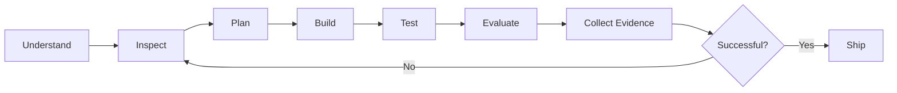

<!-- =========================================================
     DASINDU SITHMIRA — GITHUB PROFILE README
     Replace every YOUR_GITHUB_USERNAME and placeholder link.
========================================================== -->

<div align="center">


<a href="https://github.com/YOUR_GITHUB_USERNAME">
  
</a>

<br/>


</div>

---

## `> whoami`

```typescript
const dasindu = {
  name: "Dasindu Sithmira",
  role: "Founder & Product Engineer",
  company: "Corelith Technologies",
  location: "Sri Lanka 🇱🇰",

  building: [
    "Agentic Development Environments",
    "AI-native developer infrastructure",
    "Windows performance software",
    "SaaS platforms",
    "Cybersecurity systems",
    "Games and interactive experiences"
  ],

  mission:
    "Build technology that feels years ahead of what exists today.",

  currentFocus: "Paralith — the next generation Agentic Development Environment"
};
```

I am a product-focused developer and founder building ambitious software across **artificial intelligence, developer tooling, desktop applications, SaaS, cybersecurity, performance engineering, and game development**.

I care about more than shipping features. I care about creating products with strong engineering foundations, exceptional interfaces, measurable reliability, and a clear vision for the future.

---

## Corelith Technologies

<div align="center">

### Building intelligent software for the next generation.

[](https://www.corelithtechnologies.com)
[](https://github.com/YOUR_GITHUB_USERNAME)

</div>

Corelith Technologies is focused on building high-impact products that combine:

* Advanced artificial intelligence
* Agentic software engineering
* Professional product design
* Automation-first workflows
* High-performance desktop systems
* Reliable and evidence-driven engineering

---

## Flagship Project — Paralith

<div align="center">


### An AI-native development environment designed for the era after traditional IDEs.

</div>

**Paralith** is a next-generation Agentic Development Environment built to transform how developers coordinate AI agents, terminals, repositories, project memory, automation, and software delivery.

```text
Mission → Tasks → Agents → Worktrees → Execution → Evaluation → Evidence
```

### Core capabilities

* Multi-agent development workflows
* Claude and Codex integration
* Isolated Git worktrees for parallel execution
* Multi-terminal and multi-project workspaces
* Agent state and attention routing
* Repository command center
* GitHub workflows, pull requests, issues and release visibility
* Persistent project memory and contextual retrieval
* Swarm-based role assignment
* Evidence-driven task verification
* Secure project-scoped file operations
* Multi-monitor desktop workflows
* Professional desktop experience powered by Tauri

> The goal is not to create another code editor.
> The goal is to build an operating system for AI-assisted software engineering.

---

## Featured Projects

<table>
<tr>
<td width="50%" valign="top">

### Paralith

A next-generation Agentic Development Environment for coordinating AI coding agents, repositories, terminals, memory, missions and engineering evidence.

**Focus:** AI systems, developer tooling, Tauri, React, Rust, Git infrastructure

</td>
<td width="50%" valign="top">

### PulseBoost

An intelligent Windows optimization platform focused on performance, transparency, benchmarks, safe system changes and reliable rollback.

**Focus:** Windows engineering, FastAPI, React, Electron, system optimization

</td>
</tr>

<tr>
<td width="50%" valign="top">

### TyoTrack

A professional workforce time-management platform with role-based access, approval workflows, reporting, auditing and PWA support.

**Focus:** Next.js, NestJS, PostgreSQL, Prisma, Docker

</td>
<td width="50%" valign="top">

### LaunchForge AI

An AI-powered product-building platform designed to convert ideas into structured, executable software projects.

**Focus:** Next.js, local AI, product automation, SaaS architecture

</td>
</tr>
</table>

---

## Technology Arsenal

<div align="center">

### Languages


### Frameworks and Platforms


### Data and Infrastructure


### Creative and Engineering Tools


</div>

---

## Fields I’m Exploring

```yaml
artificial_intelligence:
  - Coding agents
  - Multi-agent orchestration
  - Long-term project memory
  - Retrieval augmented generation
  - Agent evaluation
  - Autonomous development workflows

software_engineering:
  - Desktop application architecture
  - Developer infrastructure
  - Secure filesystem design
  - Repository automation
  - Distributed task execution
  - Product-grade observability

cybersecurity:
  - Application security
  - Secure system architecture
  - Offensive and defensive security
  - Threat analysis
  - Security automation

creative_technology:
  - Unreal Engine
  - Game systems
  - 3D workflows
  - Interactive product experiences
```

---

## Recognition and Milestones

<div align="center">

| Achievement                                     |              Recognition              |
| :---------------------------------------------- | :-----------------------------------: |
| Asia Pacific ICT Alliance Awards 2024           |      **First Runner-Up — Brunei**     |
| Asia Pacific ICT Alliance Awards 2025           |     **Finalist — Chinese Taipei**     |
| International Science and Engineering Fair 2025 |      **Finalist — United States**     |
| Corelith Technologies                           |              **Founder**              |
| Paralith                                        | **Creator and Lead Product Engineer** |

</div>

---

## Engineering Philosophy

```text
01. Build real systems, not impressive demos.
02. Automate repetitive work, not human judgment.
03. Make agents prove what they completed.
04. Treat security and rollback as product features.
05. Design interfaces around user intent, not feature lists.
06. Keep architecture understandable as complexity grows.
07. Measure outcomes instead of trusting appearances.
08. Build for the future without sacrificing reliability today.
```

My preferred engineering loop:



---

## GitHub Analytics

<div align="center">


</div>

<br/>

<div align="center">


</div>

---

## Contribution Activity

<div align="center">

<!--
To enable this animation, create a GitHub Action that generates
output/github-contribution-grid-snake-dark.svg
-->

<picture>
  <source media="(prefers-color-scheme: dark)" srcset="https://raw.githubusercontent.com/YOUR_GITHUB_USERNAME/YOUR_GITHUB_USERNAME/output/github-contribution-grid-snake-dark.svg">
  <source media="(prefers-color-scheme: light)" srcset="https://raw.githubusercontent.com/YOUR_GITHUB_USERNAME/YOUR_GITHUB_USERNAME/output/github-contribution-grid-snake.svg">
  
</picture>

</div>

---

## Current Mission

<div align="center">

```text
Build Paralith into the world's most advanced
Agentic Development Environment.
```

</div>

Right now, I am focused on:

* Creating reliable multi-agent development workflows
* Improving long-term memory for AI coding systems
* Designing high-density professional developer interfaces
* Building repository intelligence directly into the development environment
* Making autonomous agents observable, controllable and evidence-driven
* Exploring the future of human-agent software engineering

---

## Beyond Code

```text
Technology        ████████████████████  100%
Product Vision    ███████████████████░   95%
UI/UX             ██████████████████░░   90%
AI Engineering    ██████████████████░░   90%
Cybersecurity     ███████████████░░░░░   75%
Game Development  ███████████████░░░░░   75%
Giving Up         ░░░░░░░░░░░░░░░░░░░    0%
```

I am inspired by ambitious founders, world-class engineers, bold product teams, game creators, and people who refuse to accept that the current standard is the best possible standard.

---

## Connect With Me

<div align="center">

[](https://www.corelithtechnologies.com)
[](YOUR_LINKEDIN_URL)
[](YOUR_INSTAGRAM_URL)
[](mailto:YOUR_EMAIL_ADDRESS)

<br/><br/>

### “The future is not something to predict. It is something to engineer.”

<br/>


</div>
