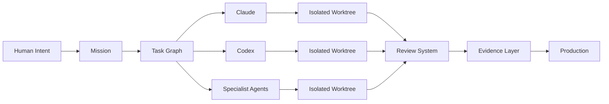
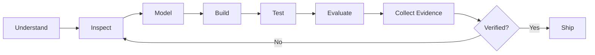

<!--
━━━━━━━━━━━━━━━━━━━━━━━━━━━━━━━━━━━━━━━━━━━━━━━━━━━━━━━━━━━━━━━━━━━━━━━━━━━━━━

DASINDU SITHMIRA
Founder, Corelith Technologies
Building Paralith — the Agentic Development Environment

GitHub:  https://github.com/dasindusithmira2025-ops
Website: https://www.corelithtechnologies.com

━━━━━━━━━━━━━━━━━━━━━━━━━━━━━━━━━━━━━━━━━━━━━━━━━━━━━━━━━━━━━━━━━━━━━━━━━━━━━━
-->

<div align="center">

<sub>CORELITH TECHNOLOGIES  ／  SYSTEMS 01</sub>

<br/><br/>

<a href="https://github.com/dasindusithmira2025-ops">
  
</a>

<br/><br/>

# DASINDU SITHMIRA

### I design the machinery behind software creation.

<br/>


<br/>

<a href="https://www.corelithtechnologies.com">
  
</a>
&nbsp;
<a href="https://github.com/dasindusithmira2025-ops/Forgespace">
  
</a>
&nbsp;


<br/><br/>

[Corelith](https://www.corelithtechnologies.com)
  ·  
[Paralith](https://github.com/dasindusithmira2025-ops/Forgespace)
  ·  
[PulseBoost](https://github.com/dasindusithmira2025-ops/pulseboost_cpp)
  ·  
[Repositories](https://github.com/dasindusithmira2025-ops?tab=repositories)

</div>

<br/>

---

```text
CORE STATUS

company      Corelith Technologies
primary      Paralith
domain       Agentic software engineering
location     Sri Lanka
state        Building

thesis       Software will be directed, observed and verified —
             not manually assembled forever.
```

## The layer after the IDE

Traditional development environments organize files, editors and terminals.

I am building for a different model of software creation—one where humans define intent, intelligent agents perform bounded work, and the environment coordinates everything between them.

```text
                    ┌──────────────────────┐
                    │     HUMAN INTENT     │
                    └──────────┬───────────┘
                               │
                               ▼
                    ┌──────────────────────┐
                    │  STRUCTURED MISSION  │
                    └──────────┬───────────┘
                               │
             ┌─────────────────┼─────────────────┐
             │                 │                 │
             ▼                 ▼                 ▼
      ┌────────────┐    ┌────────────┐    ┌────────────┐
      │  PLANNING  │    │  BUILDING  │    │  REVIEWING │
      │   AGENTS   │    │   AGENTS   │    │   AGENTS   │
      └──────┬─────┘    └──────┬─────┘    └──────┬─────┘
             │                 │                 │
             └─────────────────┼─────────────────┘
                               │
                               ▼
                    ┌──────────────────────┐
                    │ TESTS · DIFFS · RUNS │
                    │ EVIDENCE · ARTIFACTS │
                    └──────────┬───────────┘
                               │
                               ▼
                    ┌──────────────────────┐
                    │  VERIFIED SOFTWARE   │
                    └──────────────────────┘
```

The human defines the outcome.

The environment coordinates the intelligence.

The agents operate within explicit boundaries.

Nothing is considered finished merely because an AI says it is.

---

# `PARALITH`

> An agentic development environment for directing, observing and verifying software work across agents, repositories, terminals, worktrees and persistent project context.

<div align="center">

### Not another editor with a chatbot attached.

### A control system for software creation.

</div>



<details>
<summary><strong>PARALITH / SYSTEM SURFACE</strong></summary>

<br/>

```yaml
execution:
  - multi-agent software development
  - isolated Git worktrees
  - multi-terminal workspaces
  - task and dependency graphs
  - permission-aware agent actions
  - bounded execution and recovery

intelligence:
  - persistent project memory
  - repository intelligence
  - context assembly
  - agent state tracking
  - attention routing
  - contradiction and confidence handling

verification:
  - diff inspection
  - automated evaluation
  - test evidence
  - artifact provenance
  - human review gates
  - reproducible completion reports

environment:
  - multi-project operation
  - multi-monitor workspaces
  - repository command center
  - integrated browser and terminals
  - secure project-scoped filesystem
  - local-first desktop infrastructure

agents:
  - Claude
  - Codex
```

</details>

<details>
<summary><strong>PARALITH / ENGINEERING PRINCIPLES</strong></summary>

<br/>

```text
01  Agents receive bounded tasks, not unlimited authority.

02  Independent work is parallelized inside isolated worktrees.

03  Agent claims are validated through tests, diffs and artifacts.

04  Knowledge is stored as typed entities and relationships,
    not as endless chat transcripts.

05  Git history and project knowledge remain separate systems,
    connected through run and artifact provenance.

06  Humans are interrupted only when judgment is genuinely required.

07  Dangerous operations must be observable, reversible and auditable.

08  The system should reduce decisions, not create more buttons.
```

</details>

---

## Proof of work

### `01 / PARALITH`

A local-first agentic development environment for coordinating AI coding agents and the infrastructure surrounding them.

```text
Tauri · Rust · React · TypeScript · SQLite · Git
```

Current systems include multi-agent execution, mission-driven workflows, agent attention states, isolated worktrees, repository operations, persistent memory, secure file access, multi-window workspaces and evidence-based verification.

[Explore the development repository →](https://github.com/dasindusithmira2025-ops/Forgespace)

<br/>

### `02 / PULSEBOOST`

An intelligent Windows performance platform built around measurable optimization, hardware-aware decisions, transparent actions and safe rollback.

```text
Python · FastAPI · React · Electron · SQLite · Windows
```

Its core philosophy is simple: optimization should be measurable, explainable and reversible—not a collection of mysterious registry tweaks.

[Explore the repository →](https://github.com/dasindusithmira2025-ops/pulseboost_cpp)

<br/>

### `03 / TYOTRACK`

A workforce operations platform with time tracking, approval workflows, auditing, reporting, role-based access and offline-capable PWA experiences.

```text
Next.js · NestJS · PostgreSQL · Prisma · Docker
```

<br/>

### `04 / LAUNCHFORGE`

An AI-native product-building system designed to transform early ideas into structured projects, architecture decisions and executable implementation plans.

```text
Next.js · TypeScript · PostgreSQL · Local AI · Automation
```

<br/>

### `05 / CORELITH TECHNOLOGIES`

The company behind intelligent developer infrastructure, AI-native products, advanced software platforms and future computing systems.

[Visit Corelith Technologies →](https://www.corelithtechnologies.com)

---

## Current frontier

```diff
+ agentic development environments
+ graph-based engineering systems
+ multi-agent software delivery
+ long-term project memory
+ repository intelligence
+ autonomous development workflows
+ human-agent interface design
+ agent evaluation and verification
+ secure desktop infrastructure
+ evidence-driven software engineering
```

---

## How I build



```text
UNDERSTAND  → define the real outcome and constraints
INSPECT     → study the repository, runtime and existing architecture
MODEL       → create explicit entities, boundaries and success criteria
BUILD       → implement the smallest complete vertical slice
TEST        → execute real commands, builds and regression suites
EVALUATE    → compare results against deterministic expectations
PROVE       → collect diffs, logs, artifacts and reproducible evidence
SHIP        → release only when the system earns the word “complete”
```

---

## Operating principles

```text
01  AI output is not evidence.

02  Automation without observability becomes chaos.

03  Every dangerous action needs a recovery path.

04  Agents should operate inside explicit boundaries.

05  The interface is part of the architecture.

06  Complexity belongs inside the system —
    not inside the user’s head.

07  “It runs” and “it is production-ready”
    are completely different states.

08  Build real systems, not convincing simulations.

09  Optimize for user intent, not feature count.

10  The best products make ambitious work feel inevitable.
```

---

## Technology surface

```text
LANGUAGES       TypeScript · Rust · Python · JavaScript · C++ · C#
INTERFACE       React · Next.js · Tailwind CSS
BACKEND         Node.js · NestJS · FastAPI
DESKTOP         Tauri · Electron
DATA            PostgreSQL · SQLite · Prisma
INFRASTRUCTURE  Git · GitHub Actions · Docker · Linux · Windows
CREATIVE        Unreal Engine · Blender · Figma
INTELLIGENCE    Claude · Codex · RAG · Agent Memory · Evaluation Systems
```

<div align="center">

<br/>


</div>

---

## Recognition

```text
2024    Asia Pacific ICT Alliance Awards
        First Runner-Up · Brunei

2025    Asia Pacific ICT Alliance Awards
        Finalist · Chinese Taipei

2025    International Science and Engineering Fair
        Finalist · United States

NOW     Founder · Corelith Technologies

NOW     Creator and Lead Product Engineer · Paralith
```

---

## Development signal

<div align="center">


<br/>


</div>

---

## Current mission

<div align="center">

<br/>

```text
BUILD PARALITH INTO THE WORLD’S MOST ADVANCED
AGENTIC DEVELOPMENT ENVIRONMENT.
```

<br/>


<br/>

[Visit Corelith](https://www.corelithtechnologies.com)
  ·  
[Explore GitHub](https://github.com/dasindusithmira2025-ops)
  ·  
[View Paralith](https://github.com/dasindusithmira2025-ops/Forgespace)

<br/><br/>

<sub>
SRI LANKA&nbsp;&nbsp;／&nbsp;&nbsp;CORELITH TECHNOLOGIES&nbsp;&nbsp;／&nbsp;&nbsp;ENGINEERING WHAT COMES NEXT
</sub>

<br/><br/>

</div>
